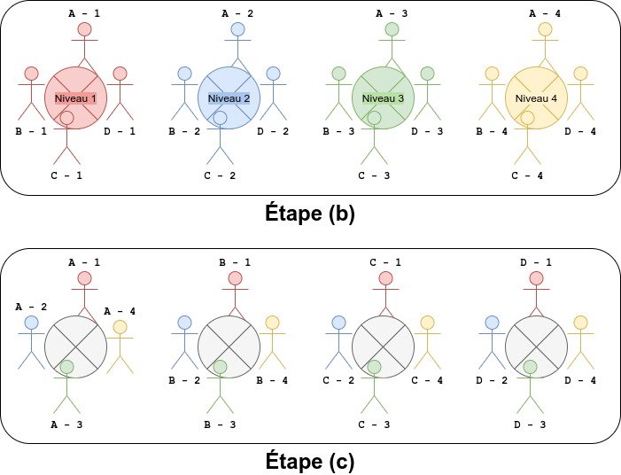
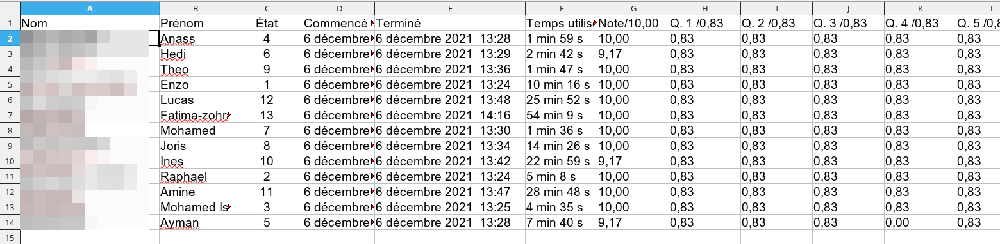
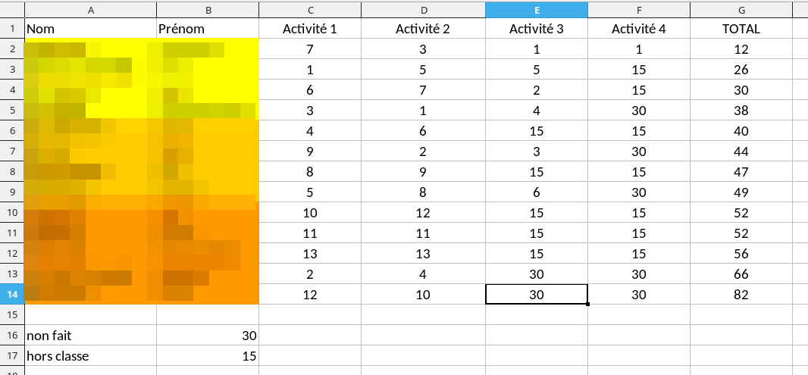
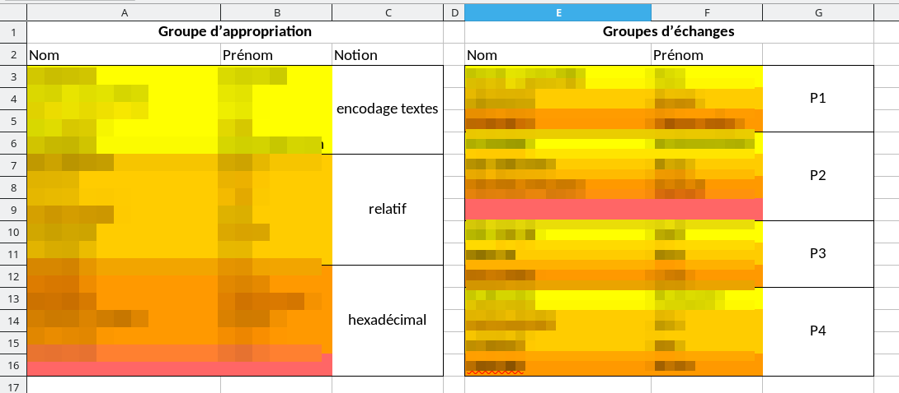

## Problématique
#### Formation des stagiaires
Écrit réflexif

<small>2022 --- [Pascal Padilla](mailto:pascal.padilla@ac-aix-marseille.fr)</small>

---

Situation professionnelle

### Exposé et analyse

<!-- .slide: data-background="img_apres.png" data-background-opacity=0.7 -->

--

#### Situation professionnelle

* enseignement de spécialité
* des élèves qui ne se connaissent pas
* pédagogie différenciée
* socio constuctivisme

**nécessité de travailler en groupe**

--

### Groupes Jigsaw

---

### Données reccueillies

<!-- .slide: data-background="img_apres.png" data-background-opacity=0.7 -->

--

--

---

### Conclusion

<!-- .slide: data-background="img_apres.png" data-background-opacity=0.7 -->
